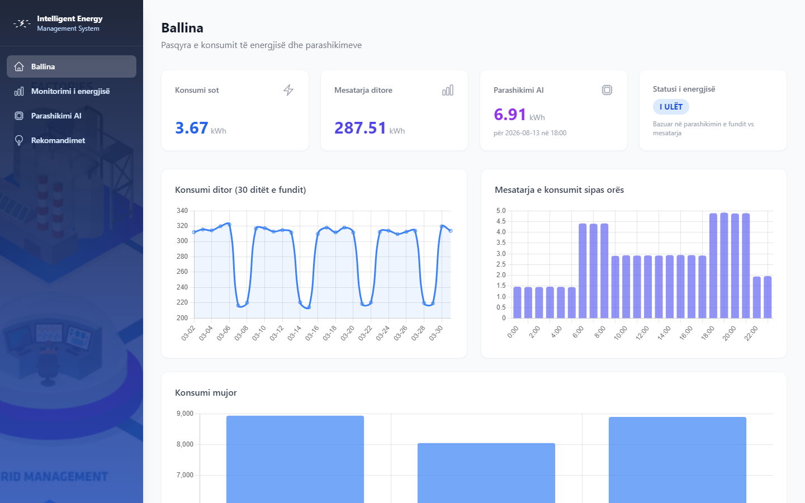
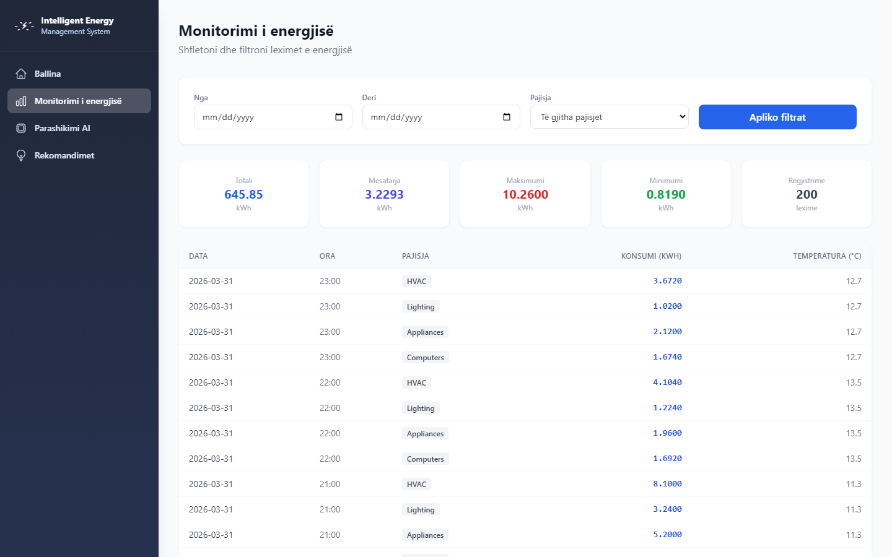
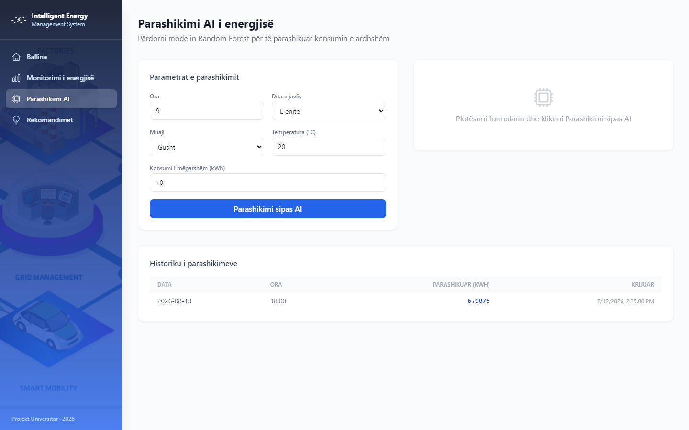
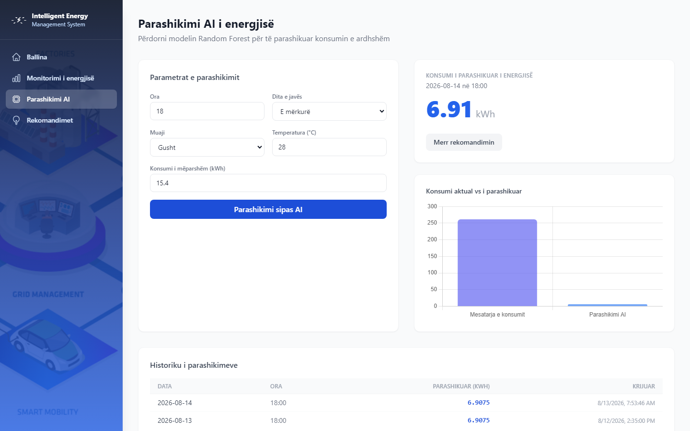
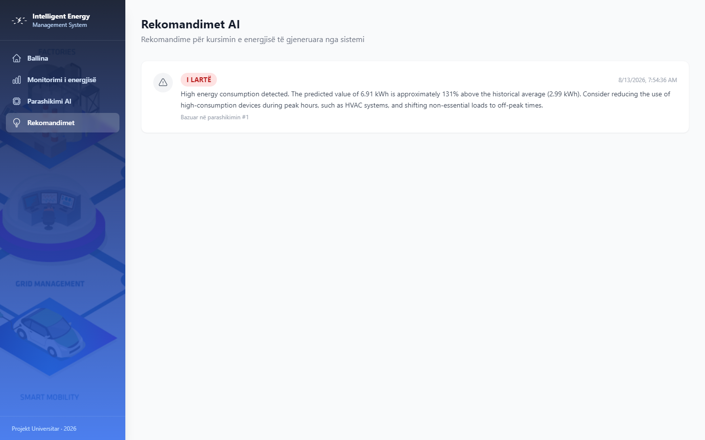

# Intelligent Energy Management System

**Project Report**

**Student:** Jehona Rizvanolli  
**Student ID:** jr50843  
**Course / Module:** Seminar & Lab në Aplikime Multidisiplinare  
**Supervisor:** Jakup Retkoceri  
**Academic Year:** 2025/2026

---

# Abstract

This project presents a web application for monitoring energy consumption and predicting future energy use for a specific hour. The system stores hourly energy readings in SQL Server and displays the information through a Vue.js web application.

The backend is developed with ASP.NET Core 8 and provides the main API used by the frontend. A separate Python service is used for the energy prediction model. The model uses information such as the hour, day of the week, month, temperature and previous consumption to estimate energy consumption.

The application also provides simple recommendations based on the predicted value and the historical average. These recommendations are based on predefined rules and are not generated by a language model.

Synthetic data is used in this project because real smart-meter data was not available during development. For this reason, the prediction results should be considered in the context of the dataset used for the project and should not be treated as results that would necessarily be obtained with real building data.

---

# 1. Introduction

## 1.1 Purpose of the Application

Energy consumption is often shown only as a monthly total. Although this gives a general idea of how much energy was used, it does not give much information about when consumption was higher or how consumption changes during the day.

The purpose of this project is to develop a web application that makes energy consumption easier to monitor and understand. Users can view energy readings, filter them by date and device, and see the information through charts and statistics.

The application also includes a prediction feature. The user can enter values such as the hour, day of the week, month, temperature and previous consumption. The system then returns an estimated energy consumption value.

After a prediction is made, the system can also provide a simple recommendation. The recommendation compares the predicted value with the historical average and classifies the result as low, normal, moderate or high.

---

## 1.2 Why This Topic

Energy monitoring can help users understand when and how energy is being consumed.

A dashboard can show historical consumption, but a prediction can give additional information about possible future consumption. This can help the user identify periods where consumption may be higher than usual.

For example, if the system predicts higher consumption during the evening, the user can check whether heating, cooling, lighting or other equipment could be responsible for the increase.

The goal of this project is not to create a complete commercial Energy Management System. Such systems can include real meters, billing, alarms, building automation and many other features.

Instead, this project focuses on a smaller working application that demonstrates energy monitoring, data analysis, prediction and recommendations.

---

## 1.3 Objectives

The main objectives of the project are:

1. Store and display hourly energy consumption data.
2. Allow users to filter energy readings by date and device.
3. Display energy consumption using tables, charts and summary values.
4. Develop a regression model for short-term energy consumption prediction.
5. Provide an API through which the web application can request predictions.
6. Compare predicted consumption with historical consumption.
7. Provide simple recommendations based on predefined thresholds.
8. Keep the user interface simple and easy to understand.

---

## 1.4 Methodology

The project was developed in several steps.

### Analysis

First, the main functionality of the application was identified. The main screens were defined as the dashboard, energy monitoring, prediction and recommendations.

The data needed by each screen was also identified. Based on this, the main functional and non-functional requirements were defined.

### Design

The main technologies were selected before implementation:

* Vue 3 for the frontend
* ASP.NET Core 8 for the backend
* SQL Server for data storage
* Python and scikit-learn for the prediction model

The frontend communicates with the ASP.NET Core API. The API communicates with SQL Server and the Python prediction service.

### Implementation

The database and seed data were created first. The backend API and prediction service were then implemented. After that, the Vue.js frontend was connected to the API and the main screens were developed.

Git was used for version control during development.

### Evaluation

The prediction model was evaluated using MAE, RMSE and R² on the test part of the generated dataset.

The application was tested manually through the web interface and Swagger. Automated unit tests were not included in the current version.

---

## 1.5 Functional and Non-Functional Requirements

### Functional Requirements

| ID  | Requirement                                                                                 |
| --- | ------------------------------------------------------------------------------------------- |
| FR1 | The user can view the main energy consumption KPIs.                                         |
| FR2 | The user can view energy readings and filter them by date and device.                       |
| FR3 | The system provides daily, hourly and monthly consumption charts.                           |
| FR4 | The user can enter prediction parameters and receive an estimated energy consumption value. |
| FR5 | Successful predictions are stored in the database.                                          |
| FR6 | The user can request a recommendation based on a prediction.                                |
| FR7 | The API can use a fallback calculation if the Python prediction service is unavailable.     |
| FR8 | The available API operations are documented through Swagger.                                |

### Non-Functional Requirements

| ID   | Requirement                                                                                             |
| ---- | ------------------------------------------------------------------------------------------------------- |
| NFR1 | The application should run locally using the configured frontend, backend and prediction service ports. |
| NFR2 | The interface should be clear and readable on a normal laptop screen.                                   |
| NFR3 | A prediction request should normally return within a few seconds during local use.                      |
| NFR4 | Database constraints should prevent invalid values such as an hour outside the 0–23 range.              |

### Out of Scope

The following features are outside the scope of the current project:

* Live smart-meter integration
* User accounts
* Role-based access
* Mobile application
* Production cloud deployment
* Payment and billing functionality

---

## 1.6 Use Cases

The main functionality can be described through three use cases.

### UC1 – Review Energy Consumption

**Actor:** Operator

The operator opens the dashboard and views the main energy consumption values. The operator can then open the monitoring page and filter the readings by device or date.

### UC2 – Request an Energy Forecast

**Actor:** Operator

The operator opens the prediction page, enters the required values and submits the form. The backend sends the request to the Python prediction service and receives the estimated energy consumption.

The prediction is then stored in the database and displayed to the user.

### UC3 – View a Recommendation

**Actor:** Operator

After receiving a prediction, the operator can request a recommendation. The backend compares the predicted consumption with the historical average and assigns a category such as HIGH, MODERATE, NORMAL or LOW.

---

# 2. Literature Review

The purpose of this literature review is to provide some background on energy monitoring and data-driven energy prediction. It is not intended to cover the whole field of energy informatics.

## 2.1 Energy Monitoring Systems

Energy Management Systems can include different functions such as energy measurement, data storage, visualisation and analysis.

In this project, the main focus is on storing energy readings and making the information easier to view and analyse.

The system stores timestamped energy consumption values and allows the data to be grouped by different time periods. The dashboard uses KPI cards and charts to present the information.

The application does not try to reproduce all the functions of a commercial energy management system. It focuses mainly on monitoring and analysis.

---

## 2.2 Data-Driven Energy Forecasting

Energy consumption can be affected by several factors, including the time of day, day of the week, temperature and previous consumption.

Previous studies have investigated different machine learning methods for predicting building energy consumption. Amasyali and El-Gohary (2018) reviewed this work and found that many studies use hourly consumption together with weather and calendar information. Olu-Ajayi et al. (2023) reviewed several data-driven tools, including Support Vector Machines, Artificial Neural Networks and Random Forest.

These studies also show that there is not one algorithm that is always the best choice. Results can depend on the building, available data, prediction target and other factors.

Ahmad, Mourshed and Rezgui (2017) compared Random Forest with artificial neural networks for high-resolution building energy prediction and treated Random Forest as a competitive method. Alsharif, Rizi and Gürsel Dino (2024) also used Random Forest for building energy estimation.

For this project, Random Forest was selected because it can handle non-linear relationships and is relatively straightforward to use with the selected features.

---

## 2.3 Random Forest and Other Methods

Random Forest was introduced by Breiman (2001) as a method that combines multiple decision trees. In this project it is implemented with scikit-learn (Pedregosa et al., 2011).

Other methods, such as neural networks and boosting algorithms, can also be used for energy prediction. However, a more complex model is not necessarily needed for a small student project.

The dataset used in this project is relatively small and synthetic. Because of this, Random Forest was selected as a suitable method for demonstrating the prediction part of the application.

The model used in this project contains 100 trees and has a maximum depth of 10.

---

## 2.4 Relation Between the Literature and This Project

The following table shows which topics from the literature are used in the project.

| Topic                    | Used in this project |
| ------------------------ | -------------------- |
| Energy monitoring        | Yes                  |
| Hourly energy data       | Yes                  |
| Temperature              | Yes                  |
| Calendar information     | Yes                  |
| Random Forest            | Yes                  |
| Deep learning            | No                   |
| Occupancy information    | No                   |
| Real smart-meter data    | No                   |
| Multi-user collaboration | No                   |

One important limitation is the data source. The project uses generated data instead of real measurements from a building.

Therefore, the prediction results should be considered within the context of the dataset created for this project.

---

# 3. Application Architecture

## 3.1 Overview

The application has four main runtime components:

```text
Browser
Vue 3 + Vite
       |
       | REST / JSON
       v
ASP.NET Core 8 Web API
       |
       +--------------------+
       |                    |
       v                    v
SQL Server          Python Prediction Service
                    FastAPI + scikit-learn
```

The browser does not connect directly to SQL Server or the Python service.

The ASP.NET Core API is used as the main communication point between the frontend, database and prediction service.

This structure also makes it possible to change the prediction service later without making major changes to the frontend.

---

## 3.2 Communication

The main communication between the components works as follows:

* Vue.js sends HTTP requests to the ASP.NET Core API.
* The ASP.NET Core API uses Entity Framework Core to access SQL Server.
* The prediction service provides an HTTP endpoint using FastAPI.
* The ASP.NET Core API sends prediction requests to the Python service.
* The Python service returns the predicted energy consumption.
* The API stores the prediction and returns the result to the frontend.

The frontend and backend are configured to run locally during development.

---

## 3.3 Backend Structure

The backend uses a simple ASP.NET Core structure.

Controllers receive HTTP requests and return responses. Services contain the main application logic. Models represent database entities, while DTOs are used for data sent through the API.

The project does not use a large multi-project architecture because the application is relatively small. Keeping the backend in one API project makes it easier to develop and maintain.

---

## 3.4 Database

The main database tables are:

### EnergyReadings

This table stores the energy consumption data.

Main fields:

* Id
* ReadingDate
* ReadingHour
* EnergyConsumption
* Temperature
* DeviceName
* CreatedDate

### Predictions

This table stores prediction results.

Main fields:

* Id
* PredictionDate
* PredictionHour
* PredictedConsumption
* CreatedDate

### Recommendations

This table stores recommendations generated after a prediction.

Main fields:

* Id
* PredictionId
* Message
* RecommendationType
* CreatedDate

The database is populated with synthetic energy readings covering the selected project period.

---

## 3.5 Prediction Flow

The prediction process works in the following way:

1. The user enters the prediction parameters in the frontend.
2. Vue.js sends the request to the ASP.NET Core API.
3. The API sends the required values to the Python service.
4. The Random Forest model generates the prediction.
5. The prediction is returned to the ASP.NET Core API.
6. The API stores the result in the database.
7. The predicted value is returned to the frontend.
8. The user can request a recommendation based on the result.

If the Python service is unavailable, the backend can use the fallback calculation implemented for the project.

---

# 4. User Registration and Authentication

The application runs locally and is used by one operator. It does not include user registration or authentication, and it does not store personal accounts.

---

# 5. Energy Monitoring

## 5.1 Energy Data

The system uses four example device categories:

* HVAC
* Lighting
* Appliances
* Computers

The generated dataset contains hourly readings for these devices.

The values were created to represent different consumption levels during different parts of the day. Higher consumption is used for periods such as morning and evening, while lower values are used during night hours.

Temperature is also included as one of the factors related to consumption.

---

## 5.2 Monitoring API

The monitoring functionality is provided through several API endpoints.

| Method | Path                     | Purpose                                  |
| ------ | ------------------------ | ---------------------------------------- |
| GET    | `/api/energy`            | Returns energy readings                  |
| GET    | `/api/energy/daily`      | Returns daily consumption                |
| GET    | `/api/energy/monthly`    | Returns monthly totals                   |
| GET    | `/api/energy/statistics` | Returns statistics used by the dashboard |
| GET    | `/api/energy/devices`    | Returns available device names           |

The endpoints support filtering where it is required by the frontend.

---

## 5.3 Monitoring Interface

The monitoring page shows a table of energy readings and provides filtering options.

The dashboard gives a more general overview using:

* KPI cards
* Energy consumption charts
* Hourly averages
* Monthly totals
* Device information

The main information is kept on a small number of pages so that the user does not have to navigate through many different screens.

---

# 6. AI-Powered Insights

## 6.1 Role of AI in the Project

The machine learning part of the project is used for energy consumption prediction.

The system uses a supervised regression model to estimate energy consumption for a specific hour.

The recommendations are not produced by another machine learning model. They are based on predefined rules that are applied to the prediction.

Therefore, the AI part of the project can be described as:

**Supervised regression for energy consumption prediction, followed by rule-based recommendations.**

---

## 6.2 Training Data

The training dataset contains hourly energy consumption information.

The generated data includes:

* Hour
* Day of week
* Month
* Temperature
* Previous consumption

The target value is the energy consumption for that hour.

The generated values include different consumption levels for night, morning, working hours and evening periods. Weekend and temperature factors are also included.

The database stores 8,640 readings: 90 days, 24 hours and 4 devices. The model is trained on 2,160 rows: 90 days and 24 hours, without a separate row for each device.

The dataset is synthetic and was created specifically for this project.

---

## 6.3 Features and Target

| Feature             | Description                       |
| ------------------- | --------------------------------- |
| hour                | Hour of the day, 0–23             |
| dayOfWeek           | Day of the week                   |
| month               | Month of the year                 |
| temperature         | Temperature in °C                 |
| previousConsumption | Previous consumption value in kWh |

**Target:** `energyConsumption`

Random Forest does not require feature scaling, so no additional scaling step is used.

---

## 6.4 Training Setup

The model used in the project is:

* Algorithm: RandomForestRegressor
* Number of trees: 100
* Maximum depth: 10
* Random state: 42
* Training/test split: 80% / 20%

The model is stored using joblib and loaded by the prediction service.

A more detailed study could compare several models and use time-based validation. This was not included because the main purpose of the project is to demonstrate the complete application rather than perform a full machine learning comparison.

---

## 6.5 Model Results

The current model produced the following results on the test data:

| Metric |      Value |
| ------ | ---------: |
| MAE    | 0.1193 kWh |
| RMSE   | 0.1695 kWh |
| R²     |     0.9914 |

The dataset is synthetic and was generated using predefined consumption patterns. Therefore, the evaluation results should be interpreted as an indication of how well the model fits this dataset rather than as a measure of performance on real-world energy data.

---

## 6.6 Prediction Service

The Python service is implemented using FastAPI.

The main endpoints are:

* `/health`
* `/predict`

The `/predict` endpoint receives the prediction parameters and returns the estimated energy consumption.

The ASP.NET Core backend communicates with this service instead of running the Python model directly.

---

## 6.7 Recommendation Rules

After a prediction is generated, the system compares it with the average energy consumption stored in the database.

The recommendation categories are:

| Condition                    | Type     | Example                                  |
| ---------------------------- | -------- | ---------------------------------------- |
| Prediction > 120% of average | HIGH     | High consumption                         |
| Prediction > 105% of average | MODERATE | Slightly high consumption                |
| 90%–105% of average          | NORMAL   | Consumption is within the expected range |
| Prediction ≤ 90% of average  | LOW      | Lower consumption                        |

These thresholds are predefined project rules.

They are not learned from the dataset.

The recommendation messages are intended to give the user a simple explanation of the prediction.

---

## 6.8 Fallback Prediction

The backend also contains a fallback calculation in case the Python service is not available.

The fallback uses simple factors based on:

* Hour of the day
* Temperature
* Weekend status
* Previous consumption

This allows the API to return a value even when the prediction service is temporarily unavailable.

The fallback is mainly included so that the application can still demonstrate the prediction functionality if the Python service is stopped.

---

# 7. User Interface Design

## 7.1 Design Approach

The application is implemented as a single-page web application.

The main navigation contains:

* Dashboard
* Monitoring
* Prediction
* Recommendations

The interface was developed in Vue.js. Each page is focused on one task:

* Dashboard – general overview
* Monitoring – detailed energy readings
* Prediction – energy forecast
* Recommendations – previous recommendations

---

## 7.2 Main Screens

### Dashboard

The dashboard gives an overview of the available energy data.

It contains:

* KPI cards
* Energy consumption chart
* Hourly consumption chart
* Monthly information
* Latest prediction information



*Figure 1. Dashboard with the main consumption values and charts.*

### Monitoring

The monitoring page shows the energy readings and filtering options.

The user can select a device and a date range.



*Figure 2. Monitoring page with energy readings and filter options.*

### Prediction

The prediction page contains a form where the user enters the required parameters.

The result is displayed after the prediction request is completed.

A recommendation can then be requested for the prediction.



*Figure 3. Prediction form and the list of previous predictions.*



*Figure 4. Prediction result for 18:00 on a Wednesday in August, with temperature 28°C and previous consumption 15.4 kWh.*

### Recommendations

The recommendations page shows previously generated recommendation messages.



*Figure 5. Recommendation generated from a stored prediction.*

### Swagger

Swagger is used to test and document the backend API. While the API is running, it lists the energy, prediction and recommendation operations.

---

## 7.3 Usability

The main goal of the interface is to keep the important information visible without requiring many steps.

The prediction form also contains basic validation. For example, the hour field only accepts values between 0 and 23.

The application is designed for a desktop or laptop browser.

---

# 8. Testing and Debugging

## 8.1 Testing Approach

Testing was mainly done manually.

Swagger was used to test the backend API, while the Python FastAPI documentation was used to test the prediction endpoint.

The Vue application was also tested by running the complete system and going through the main user flows.

The model script was used to calculate MAE, RMSE and R² after training.

No automated unit-test project or CI pipeline was included in the current version.

---

## 8.2 Model Tests

| ID | Test                                             | Expected Result                                    | Result |
| -- | ------------------------------------------------ | -------------------------------------------------- | ------ |
| M1 | Run the model training script                    | Dataset, model and metrics are generated           | Pass   |
| M2 | Send a prediction request with normal parameters | Positive predicted consumption is returned         | Pass   |
| M3 | Send a night-time prediction                     | Lower consumption than an evening peak is expected | Pass   |

---

## 8.3 API Tests

| ID | Test                                           | Expected Result                            | Result                            |
| -- | ---------------------------------------------- | ------------------------------------------ | --------------------------------- |
| A1 | GET energy statistics                          | KPI data is returned                       | Pass                              |
| A2 | Filter energy readings by device               | Only selected device readings are returned | Pass                              |
| A3 | Submit a valid prediction                      | Prediction is returned and stored          | Pass                              |
| A4 | Request a recommendation                       | Recommendation type and message are stored | Pass                              |
| A5 | Send an unreadable date to the readings endpoint | A validation message is returned         | Pass                              |
| A6 | Stop the Python service and request prediction | Backend uses the fallback                  | Pass                              |

---

## 8.4 UI and End-to-End Tests

| ID | Test                                  | Expected Result                        | Result |
| -- | ------------------------------------- | -------------------------------------- | ------ |
| U1 | Open the dashboard                    | Dashboard data is displayed            | Pass   |
| U2 | Filter monitoring by device           | Table is updated                       | Pass   |
| U3 | Submit an evening prediction          | A higher consumption value is expected | Pass   |
| U4 | Request a recommendation              | Recommendation is displayed            | Pass   |
| U5 | Open recommendations                  | Stored recommendation is visible       | Pass   |
| U6 | Stop the API and reload the dashboard | An error message is displayed          | Pass   |

---

## 8.5 Validation of Predictions and Recommendations

The prediction functionality was checked using different combinations of input values.

For example, peak-hour values, night-time values, different temperatures and weekend values were tested.

The purpose of these tests was to check whether the results followed the general patterns expected from the generated dataset.

This type of testing is mainly a basic check of the model behaviour. It is not a replacement for testing the model with real building data.

---

# 9. Documentation and Implementation Notes

## 9.1 Project Structure

The main project components are:

| Component          | Location                        |
| ------------------ | ------------------------------- |
| Project report     | `DOCUMENTATION.md`              |
| Run instructions   | `README.md`                     |
| Database           | `Database/CreateDatabase.sql`   |
| Backend API        | `Backend/IntelligentEnergy.API` |
| Prediction service | `AI-Service`                    |
| Frontend           | `Frontend/src/views`            |

The backend API is documented using Swagger, while the Python service provides its own FastAPI documentation.

---

## 9.2 Short User Manual

To run the project locally:

1. Create the database using `CreateDatabase.sql`.
2. Start the ASP.NET Core API.
3. Install the Python dependencies.
4. Start the FastAPI prediction service.
5. Install the frontend dependencies.
6. Start the Vue development server.
7. Open the application in the browser.
8. Use the Dashboard to view the energy data.
9. Open Monitoring to filter and inspect readings.
10. Open Prediction to request an energy forecast.
11. Request a recommendation for the prediction.
12. Open Recommendations to see the stored results.

The prediction is an estimate for the selected hour.

---

## 9.3 Technologies and Tools

| Area              | Technology                                           |
| ----------------- | ---------------------------------------------------- |
| Frontend          | Vue 3, TypeScript, Vite, Tailwind CSS, Chart.js      |
| Backend           | ASP.NET Core 8, C#, Entity Framework Core            |
| Database          | SQL Server                                           |
| Machine Learning  | Python, FastAPI, scikit-learn, pandas, numpy, joblib |
| API Documentation | Swagger / OpenAPI                                    |
| Version Control   | Git                                                  |
| Testing           | Manual testing and model metrics                     |
| Deployment        | Localhost                                            |

---

# 10. Presentation and Demonstration

The project is submitted through a Git repository containing the complete source code and documentation.

The repository includes the implemented application, database scripts, prediction service and the documentation required to understand and run the project.

Repository: https://github.com/Jehonar/IntelligentEnergyManagement

---

# 11. Results and Discussion

The main features of the application were implemented and tested during development.

The complete flow can be demonstrated from the database and API to the web interface and prediction service.

The current prediction model achieved an MAE of 0.1193 kWh and an R² of 0.9914 on the generated test data.

These values need to be considered carefully. The dataset is synthetic and was created using rules that are also reflected in the model features. Because of this, the high R² value does not mean that the same result would necessarily be achieved with real energy measurements.

The recommendation system is also simple. It compares the prediction with a general historical average. A future version could compare a prediction with the average consumption for the same hour and day of the week.

Another limitation is that the project does not currently include authentication or automated tests.

Overall, the project provides a working prototype that combines energy monitoring, data analysis, prediction and recommendations in one application.

---

# 12. Conclusion

The Intelligent Energy Management System combines a web frontend, a backend API, a SQL Server database and a separate machine learning service.

The application allows the user to monitor energy consumption, look at historical readings, request an energy prediction and receive a simple recommendation based on the result.

The architecture is relatively simple and was chosen to keep the project manageable as a student project.

The main limitation is the use of synthetic data. In a future version, the system could be connected to a real or public energy dataset. Other possible improvements include user authentication, automated API tests, improved recommendation rules and time-based model validation.

The current version provides a practical example of how software, data and machine learning can be combined in an energy management application.

---

# References

Ahmad, M.W., Mourshed, M. and Rezgui, Y. (2017). ‘Trees vs Neurons: Comparing random forest and ANN for high-resolution prediction of building energy consumption’. *Energy and Buildings*, 147, pp. 77–89.

Alsharif, R., Rizi, M. and Gürsel Dino, I. (2024). ‘Building energy efficiency estimations with random forest for single and multi-zones’. *eCAADe*.

Olu-Ajayi, R., Alaka, H., Owolabi, H., Akanbi, L. and Ganiyu, S. (2023). ‘Data-driven tools for building energy consumption prediction: A review’. *Energies*, 16(6), 2574.

Amasyali, K. and El-Gohary, N.M. (2018). ‘A review of data-driven building energy consumption prediction studies’. *Renewable and Sustainable Energy Reviews*, 81, pp. 1192–1205.

Breiman, L. (2001). ‘Random forests’. *Machine Learning*, 45.

Pedregosa, F. et al. (2011). ‘Scikit-learn: Machine learning in Python’. *Journal of Machine Learning Research*, 12, pp. 2825–2830.

Microsoft. (2024). *ASP.NET Core documentation*.

Vue.js. (2024). *Vue 3 documentation*.

---

# Appendix A – Main API Example

Example prediction request:

```json
{
  "hour": 18,
  "dayOfWeek": 2,
  "month": 8,
  "temperature": 28,
  "previousConsumption": 15.4
}
```
